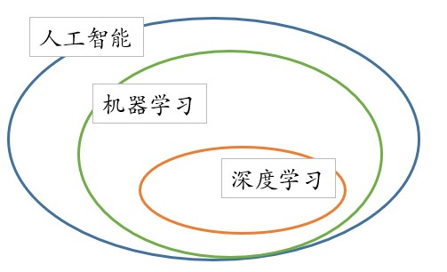

# 第一章 序言

## 1. 什么是机器学习

机器学习是人工智能的分支之一。人工智能的研究历史从一开始以“推理”为重点，到以“知识”为重点，再到以“学习”为重点的不断进化过度。而机器学习就是实现人工智能的重要途径之一，即以机器学习为手段解决人工智能中存在的问题。机器学习在近30多年已发展为一门多领域交叉学科，涉及概率论、统计学、逼近论、凸分析、计算复杂性理论等多门学科。机器学习理论主要是设计和分析一些让计算机可以自动“学习”的算法。机器学习算法是一类从数据中自动分析获得规律，并利用规律对未知数据进行预测的算法。因为学习算法中涉及了大量的统计学理论，机器学习与推断统计学联系尤为密切，也被称为统计学习理论。算法设计方面，机器学习理论关注可以实现的，行之有效的学习算法。很多推论问题属于无程序可循难度，所以部分的机器学习研究是开发容易处理的近似算法。

机器学习已广泛应用于数据挖掘、计算机视觉、自然语言处理、生物特征识别、搜索引擎、医学诊断、检测信用卡欺诈、证券市场分析、DNA序列测序、语音和手写识别、战略游戏和机器人等领域。

### 1.1 定义

机器学习有下面几种定义：

- 机器学习是人工智能下的一门学科，该领域的主要研究对象是人工智能，特别是如何在经验学习中改善具体算法的性能。
- 机器学习是对能通过经验自动改进的计算机算法的研究。
- 机器学习是用数据或以往的经验，以此优化计算机程序的性能标准。

>一种经常引用的英文定义是：A computer program is said to learn from experience E with respect to some class of tasks T and performance measure P, if its performance at tasks in T, as measured by P, improves with experience E.

翻译成中文大意就是：一个计算机程序在任务T及性能度量P方面从经验E中学习，当随着经验E不断的提高，评价完成任务T的性能度量P也不断提高。

简而言之，即一个计算机程序会随着不断从经验中学习而获得更优的性能！

### 1.2 分类

机器学习可以分成下面几种类别：

- 监督学习：从给定的训练数据集中学习出一个函数，当新的数据到来时，可以根据这个函数预测结果。监督学习的训练集要求是包括输入和输出，也可以说是特征和目标。训练集中的目标是由人标注的。常见的监督学习算法包括回归分析和统计分类。
- 无监督学习（非监督学习）：训练集没有人为标注的结果。常见的无监督学习算法有生成对抗网络（GAN）、聚类。
  
>监督学习和非监督学习的差别就是训练集目标是否人标注。他们都有训练集 且都有输入和输出

- 半监督学习：介于监督学习与无监督学习之间，在有标签数据+无标签数据混合成的训练数据中训练机器学习算法。一般无标签数据比有标签数据多，甚至多得多。
- 增强学习：机器为了达成目标，随着环境的变动，而逐步调整其行为，并评估每一个行动之后所到的回馈是正向的或负向的。

### 1.2 算法

具体的机器学习算法有：

- 构造间隔理论分布：聚类分析和模式识别
  - 人工神经网络
  - 决策树
  - 感知器
  - 支持向量机
  - 集成学习AdaBoost
  - 降维与度量学习
  - 聚类
  - 贝叶斯分类器
- 构造条件概率：回归分析和统计分类
  - 高斯过程回归
  - 线性判别分析
  - 最近邻居法
  - 径向基函数核
  - 通过再生模型构造概率密度函数：
  - 最大期望算法
- 概率图模型：包括贝叶斯网和Markov随机场
  - Generative Topographic Mapping
  - 近似推断技术：
  - 马尔可夫链
  - 蒙特卡罗方法
  - 变分法
- 最优化：大多数以上方法，直接或者间接使用最优化算法。
  
## 2. 机器学习的定位

机器学习是隶属于人工智能大类之下的一门学科，而同样火热的一门学科——深度学习则是在机器学习范围内的一个分支之一，当我们学习这门课的时候，对这些基础还是很有必要了解的。

### 2.1 人工智能

人工智能（Artificial Intelligence, AI）是机器，特别是计算机系统对人类智能过程的模拟。人工智能是一个愿景，目标就是让机器能够像人类一样对事物行为能够在一定的实践经验中思考与行动，最终能够代替人类去完成工作，解放生产力。

人工智能研究的范围非常广，包括演绎、推理和解决问题、知识表示、学习、运动和控制、数据挖掘等众多领域。其中，知识表示是人工智能领域的核心研究问题之一，它的目标是让机器存储相应的知识，并且能够按照某种规则推理演绎得到新的知识。

### 2.2 机器学习

机器学习（Machine Learning，ML）是指机器从经验中自动学习和改进的过程，不需要人工编写程序指定规则和逻辑。也被称为隐式编程。

“学习”的目的是获得知识。机器学习的目的是让机器从用户的输入数据中进行训练分析并最终获得知识，以便在生产、生活的实际环境中，能够对该类行为或动作自动作出判断和响应，从而帮助我们解决更多问题、减少错误、提高效率。

一般来说，机器学习往往需要人工提取特征，这一过程称为特征工程（Feature Engine）。人工提取特征，在部分应用场景中可以较为容易的完成，但是在一部分应用场景中却难以完成，比如图像识别、语音识别等场景，自然而然地，我们希望机器能够从样本数据中自动的学习、自动的发现样本数据中“特征”，从而能够自动地完成样本数据分类。

### 2.3 深度学习

深度学习（Deep Learn，DL）是机器学习的一种，主要特点是使用多层非线性处理单元进行特征提取和转换。每个连续的图层使用前一层的输出作为输入。

从深度学习的定义中，我们可以得知深度学习是机器学习的一种，是机器学习的子集。同时，与一般的机器学习不同，深度学习强调以下几点：

**（1）强调了模型结构的重要性**：深度学习所使用的深层神经网络（Deep Neural Network，DNN）算法中，隐藏层往往会有多层，是具有多个隐藏层的深层神经网络，而不是传统“浅层神经网络”，这也正是“深度学习”的名称由来。

**（2）强调非线性处理**：线性函数的特点是具备齐次性和可加性，因此线性函数的叠加仍然是线性函数，如果不采用非线性转换，多层的线性神经网络就会退化成单层的神经网络，最终导致学习能力低下。深度学习引入激活函数，实现对计算结果的非线性转换，避免多层神经网络退化成单层神经网络，极大地提高了学习能力。

**（3）特征提取和特征转换**：深层神经网络可以自动提取特征，将简单的特征组合成复杂的特征，也就是说，通过逐层特征转换，将样本在原空间的特征转换为更高维度空间的特征，从而使分类或预测更加容易。与人工提取复杂特征的方法相比，利用大数据来学习特征，能够更快速、方便地刻画数据丰富的内在信息。

## 3 显著性编程和隐式编程

显著性编程就是日常所接触的编程，它是流水线式的，所有的操作都是按部就班编写好的，代码相应参数是相对固定的，代码可能会出现自适应调节，但是该自适应调节是在人为可知的情况下进行的。

隐式编程在于某些关键参数并未直接给定，需要程序自身根据数据集训练并分析最终得出相应的参数，以使程序能够完成该事件。隐式编程是自适应的，即程序系统自身会根据经验不断的对相应参数进行调整，以达到更好的效果。且自适应是不可知的，且不可预测的，无法人为提前给出的行为。

>举例：以从学校到家这一事件为例
>
> - 显著式编程：按照上图的路径，先向东走多少米，然后向北转走多少米，接着再向东转走对应距离，再向北转走对应距离，最后向东转就到家了。
> - 隐式编程：在隐式编程中，没有直接的代码，而是需要从数据中训练出来。假设有很多数据，每一条数据都对应一个结果，通过这些数据的不断训练，程序最终可以从学校走到家。

从上面的示例可以看出，隐式编程和数据是分不开的，一般来说，要想获得比较优秀的性能，那么训练的数据不会太少。
