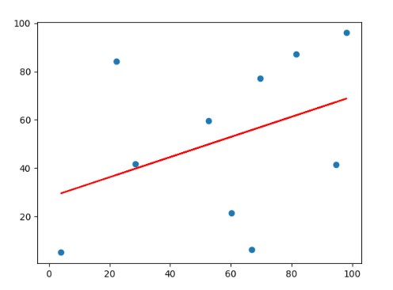

# 标准方程法

## 1 引言

标准方程法是一种和梯度下降法类似的求解代价函数最优参数的方法。两者之间的区别如下表所示：

| 优缺点 | 标准方程法                                                                           | 梯度下降法                                                           |
| ------ | ------------------------------------------------------------------------------------ | -------------------------------------------------------------------- |
| 优点   | 不需要学习率以及迭代，可以直接通过计算得到最优参数                                   | 在特征值较多的情况下也能很好的使用                                   |
| 缺点   | 需要计算$(X^TX)^{-1}$，且时间复杂度是特征数的三次方级别$O(n^3)$，其中 $n$ 是特征数量 | 需要选择合适的学习率，且需要一定的迭代次数，同时只能获取近似最优参数 |

## 2 描述

标准方程法运用的是线性代数的方法进行参数求解。下面以一个多元方程为例：

假设有如下一个方程：

$$
h(x_1,x_2,...,x_n) = \theta_0+\theta_1x_1+\theta_2x_2+...+\theta_nx_n\tag{1}
$$

将上述方程写成矩阵形式则有：

$$
h(x_1,x_2,...,x_n) = \theta x^T\tag{2}
$$

其中 $\theta=(\theta_0,\theta_1,\theta_2,...,\theta_n),x=(1,x_1,x_2,...,x_n)$.

因此当使用数据集进行回归时，就相当于有有限多个这样的方程组成方程组，下面以 $n$ 组数据为例，方程组形式如下：

$$
\begin{cases}
    \theta_0+\theta_1x_1^0+\theta_2x_2^0+...+\theta_nx_n^0=y_0\\
    \theta_0+\theta_1x_1^1+\theta_2x_2^1+...+\theta_nx_n^1=y_1\\
    ...\\
    \theta_0+\theta_1x_1^n+\theta_2x_2^n+...+\theta_nx_n^n=y_n\\
\end{cases}\tag{3}
$$

将上式描述成矩阵运算的形式如下：

$$
\Theta X^T=Y\tag{4}
$$

其中 $\theta=(\theta_0,\theta_1,\theta_2,...,\theta_n)$，与上面想比没有改变，但是此时的 $X$ 是代表所有方程数据，如下所示：

$$
X=\begin{bmatrix}
    1&x_1^0&x_2^0&\cdots&x_n^0\\
    1&x_1^1&x_2^1&\cdots&x_n^1\\
    \vdots&\vdots&\vdots&\ddots&\vdots\\
    1&x_1^n&x_2^n&\cdots&x_n^n\\
\end{bmatrix}\tag{5}
$$

需要注意的是，在给出的数据并没有第一列全为1的数，因此在使用标准方程法时，需要自动加上去。

接下来就是使用均方误差求解代价函数：

$$
f=\frac{1}{2N}\sum_{i=1}^N(y_i-h_i)^2\tag{6}
$$

其中 $h_i$ 代指第 $i$ 组数据带入 $h(x_1,x_2,...,x_n)$ 的值，根据线性代数求解公式，(6)可写成：

$$
f=\frac{1}{2N}(X\Theta-Y)^T(X\Theta-Y)\\=\frac{1}{2N}(Y^TY-Y^TX\Theta-\Theta^TX^TY+\Theta^TX^TX\Theta)\tag{7}
$$

然后对其进行统一求偏导，由于将参数自变量及因变量都各自写成了整体，所有我们就只需要用 $f$ 对 $\Theta$ 求偏导，并令最终的偏导为零，即误差为零。此时求解得到的 $\Theta$ 便是最优参数。

最终通过化简可以得出最优参数求解公式：

$$
\Theta=(X^TX)^{-1}X^TY\tag{8}
$$

## 3 使用标准方程法求解最优回归

首先进行数据初始化，由于本次使用的是超过三维，无法利用图像展示，因此直接以代码方式呈现：

```py
import pandas as pd
import numpy as np
import matplotlib.pyplot as plt

# 生成数据
x_data = np.random.random([10, 3]) * 100
y_data = np.random.random(10) * 100
dataframe = pd.DataFrame(x_data, y_data)
# header=False 由于只存数据，不需要表头
dataframe.to_csv("data1.cvs", header=False)
```

将生成的数据存放在名为 data1.cvs 的数据表中，防止每次都要生成，并且每次都不一样，接下来算法就直接从 data1.cvs 中读取数据并按照方程需要进行修改。

```py
# 获取数据
data = np.genfromtxt("data1.cvs", delimiter=',')
x_data = data[:, 0:-1]
y_data = data[:, -1]
# 给数据增加一列，其值全为1，位置在第一列
x_data = np.c_[np.ones(x_data.shape[0]).T, x_data]
```

编写标准方程法求解参数：

```py
def RegressWithStandardEquation(X, Y):
    Theta = np.linalg.inv(np.dot(X.T, X)).dot(X.T).dot(Y)
    return Theta
```

是的，没看错，只需要三行代码，不需要迭代，只需要按照线性代数求解计算公式(8)即可。最后运行求解得出最佳参数输出为：

>[56.28248148  0.15217534  0.17250314 -0.32907481]

从左至右分别是：$\theta_0,\theta_1,\theta_2,\theta_3$，且 $\theta_0$就是方程的截距，即公式(3) 所描述的。

为了对比，再次使用梯度下降法中的一元回归进行验证，比较标准方程法与梯度下降法之间的参数差别：

数据为：

```text
81.51371108149964,87.18105990728436
66.92873372104945,6.249443031023716
22.208453785015926,84.12708051681675
98.24239729554425,96.01534708556177
3.966845357306392,5.01544847279124
28.454751761950693,41.59778917409067
94.7663503420448,41.46882997100094
69.71688441141511,77.24260773938289
60.1789758707342,21.383311305784336
52.67272898140581,59.43666603188432
```

上面数据与数据之间使用逗号分隔开来，并将第一列作为 $x$ 轴数据，第二列作为 $y$ 轴数据，数据在二维轴中的位置如下图所示：


使用梯度下降法100次迭代求解最终图像为：


最终代价为：
>521.608842906717

使用标准方程法求解的回归函数图像为：



最终代价为：
>440.9606272417209

因此可以看出使用标准方程法得到的参数方程代价要远低于使用梯度下降法所得的的！

>标准方程代码，见 $code$ 文件夹下的 RegressWithStandardEquation.py 文件！

## 4 缺陷

在使用标准方程法进行求解时，可能会出现一个问题，即矩阵不可逆，出现该情况的原因一般有两种：

- 具有共同特征：比如评价一个人，里面有两个身高特征，只不过一个用厘米作为计数标准，一个用米作为计数标准，但其实两者说明的问题是一致的。
- 特征数太多（样本数 $\leq$ 特征数），这会造成算法有无数解

因此在使用该方法时，首先要避免上面两个问题的发生！
