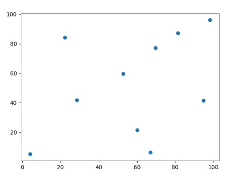
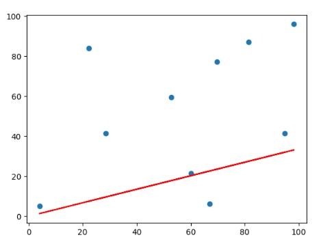
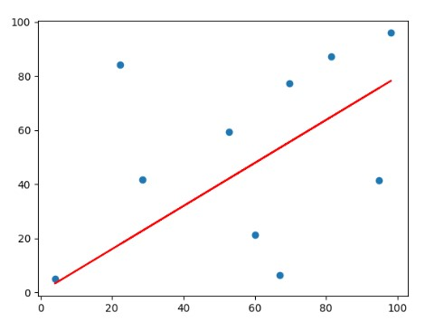

# 一元线性回归

本小节使用梯度下降算法实现一元线性回归。

## 1 数据点的生成

本次数据可自己采用随机生成的方式准备，如下python代码：

```py
import pandas as pd
import numpy as np
#生成数据
x_data = np.random.random(10) * 100
y_data = np.random.random(10) * 100
dataframe = pd.DataFrame({'x_data': x_data, 'y_data': y_data})
# header=False 由于只存数据，不需要表头
dataframe.to_csv("data.cvs", header=False, index=False)
```

本处是为了后续使用方便，不用重复生成，因此将数据存入 data.cvs 文件中。在本文中生成的数据如下：

```text
81.51371108149964,87.18105990728436
66.92873372104945,6.249443031023716
22.208453785015926,84.12708051681675
98.24239729554425,96.01534708556177
3.966845357306392,5.01544847279124
28.454751761950693,41.59778917409067
94.7663503420448,41.46882997100094
69.71688441141511,77.24260773938289
60.1789758707342,21.383311305784336
52.67272898140581,59.43666603188432
```

上面数据与数据之间使用逗号分隔开来，并将第一列作为 $x$ 轴数据，第二列作为 $y$ 轴数据，数据在二维轴中的位置如下图所示：



接下来编写对应代码！

## 2 代码编写

首先从已经准备好的数据中读取数据：

```py
data = np.genfromtxt("data.cvs", delimiter=',')
x_data = data[:, 0]
y_data = data[:, 1]
```

接着创建一个 $UnaryLinearRegression$ 类，编写初始化函数：

```py
def __init__(self):
    """
    初始化函数：初始化学习率，斜率a，截距b
    """
    self.lr = 0.0001
    self.a = 0
    self.b = 0
```

需要注意的是学习率的设置，不要太大，甚至于不应该大于 $0.0001$ ，否则你会发现损失函数随着迭代次数的增加反而再增加。

接下来定义损失函数及使用梯度下降函数，由于在本例中是一元回归，因此函数形式可写成：

$$
h(x) = ax + b \tag{1}
$$

因此损失函数为：

$$
f=\frac{1}{2N}\sum_{i=1}^N(y_i-h(x_i))^2\tag{2}
$$

将 $h(x)$ 代入损失函数可得：

$$
f=\frac{1}{2N}\sum_{i=1}^N(y_i-ax_i - b)^2\tag{3}
$$

因此损失函数代码可写成：

```py
def costFunction(self, x, y):
    cost = np.sum((y - self.b - self.a * x) ** 2)
    return cost / len(x) / 2
```

上面代码使用了矩阵运算，因此没有使用循环迭代对每一个位置的损失进行相加。

接着根据上面的损失函数计算梯度下降更新公式：

$$
\begin{gathered}
    Repeat\{\\
    & a=a-\eta \frac{\partial f}{\partial a}\\
    & b=b-\eta \frac{\partial f}{\partial b}\\
\}
\end{gathered}\tag{4}
$$

通过(3)式计算对 $a、b$ 的偏导数为：

$$
\begin{gathered}
\frac{\partial f}{\partial a} = \frac{1}{N}\sum_{i=1}^N((y_i-ax_i - b) x_i)\\
\frac{\partial f}{\partial b} = \frac{1}{N}\sum_{i=1}^N(y_i-ax_i - b)
\end{gathered}\tag{5}
$$

此外需要注意的是，虽然在公式(4)中明确写了梯度下降更新公式，但实际在代码中并不是按照该顺序执行，由于参数 $a、b$ 在偏导数计算的时候会被使用，因此倘若按照公式(4)的形式进行更新，则会造成计算偏差，在计算 $b$ 更新时，使用的不是之前的 $a$，而是已经更新了的 $a$。因此计算公式应该如下所示：

$$
\begin{gathered}
    Repeat\{\\
    & grad_a=\eta \frac{\partial f}{\partial a}\\
    & grad_b=\eta \frac{\partial f}{\partial b}\\
    & a=a-grad_a\\
    & b=b-grad_b\\
\}
\end{gathered}\tag{6}
$$

使用上面的公式，就不会存在上述问题，相应的代码如下：

```py
def gradientDescent(self, x, y):
    n = len(x)
    gradient_a = -(np.sum(x * (y - self.b - self.a * x)) / n)
    gradient_b = -np.sum(y - self.b - self.a * x) / n
    self.a -= self.lr * gradient_a
    self.b -= self.lr * gradient_b
```

迭代优化如下图：



最终结果图：



>全部代码在 $code$ 文件夹下，请自取
