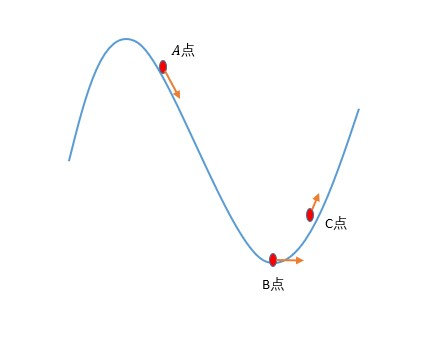
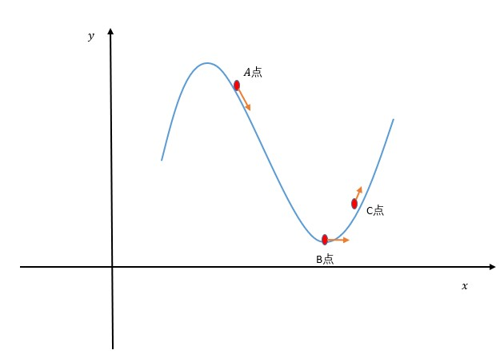
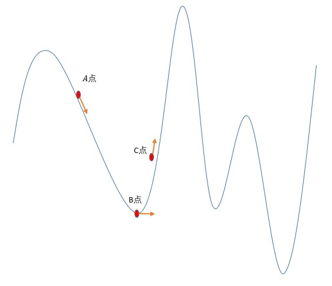

# 梯度下降算法

## 1 简介

梯度下降（gradient descent）在机器学习中应用十分的广泛，不论是在线性回归还是Logistic回归中，它的主要目的是通过迭代找到目标函数的最小值，或者收敛到最小值。

下面我们通过下山这个情形对梯度下降进行讲解：

如上图所示，假设我们在下山的过程，例如图中的A点，我们的方向是向下的，因此我们可以感知自身处于下山这个过程，当到达B点，我们身体以及方向是水平的，则说明已经到达山谷，或者说这个坡的最低点，当往C点走的时候，就是上山，人也可以通过自身感知找到最低点。而梯度下降法就是这样的一个算法。

## 2 梯度

对于一个算法而言，肯定无法从人的角度去感知是否在最低点。但是可以利用倒导数了解当前所在位置变化状态，一般说来，在极值点导数为零。当在其他位置导数绝对值都是大于0的。因此只需要让该点按照变化方向相反位置移动，就会不断接近极值点。

但是一般求解要具有普适性，因此，在多元中，它有了另外一个名字：**梯度**。

梯度的定义如下：

$$
gradf(x_0,x_1,...,x_n)=(\frac{\partial f}{\partial x_0},\frac{\partial f}{\partial x_1},...,\frac{\partial f}{\partial x_n})\tag{1}
$$

对于 $f(x_0,x_1,...,x_n)$ 上的某一点来说存在很多个方向导数，梯度的方向是函数 $f(x_0,x_1,...,x_n)$ 在某一点增长最快的方向，梯度的模则是该点上方向导数的最大值，梯度的模等于：

$$
|gradf(x_0,x_1,...,x_n)|=\sqrt{(\frac{\partial f}{\partial x_0})^2+(\frac{\partial f}{\partial x_1})^2+...+(\frac{\partial f}{\partial x_n})^2}\tag{2}
$$

对于梯度需要注意的是：

- 梯度是一个向量，既有方向，又有大小
- 梯度的方向是最大方向导数的方向
- 梯度的值是最大方向导数的

## 3 梯度下降法

既然在多元函数空间的某一点处时可以求解函数沿梯度方向具有的最大变化率，那么在优化代价函数的时候，就可以沿着负梯度方向去找到变化率最小的位置，即极值点，减小代价函数的值。计算过程可以描述如下：

$$
\begin{gathered}
    Repeat\{\\
    & x_0=x_0-\eta \frac{\partial f}{\partial x_0}\\
    & x_1=x_1-\eta \frac{\partial f}{\partial x_1}\\
    & ...\\
    & x_n=x_n-\eta \frac{\partial f}{\partial x_n}\\
\}
\end{gathered}
$$

上面的 $Repeat$ 表示不断重复上述过程，因为并非一次就能到位，需要不停的重复操作进行调整。

其中上面的 $\eta$ 表示学习率，学习率的设置一般在0-1之间，太大太小都不好，应该根据具体情况适当调整。

## 4 示例

下面以二维例子演示：

还是这个例子，我们不做具体数值，提供一个大致讲解过程。

假设一开始在 $A$ 点，根据梯度定义，该点增长的方向当前箭头的反方向，因此学习朝着当前箭头的方向进行移动，假设学习率比较小，则可能依旧在 $A、B$ 之间，当学习率比较大，则可能位于 $C$ 点，不管在哪个位置，我们都需要重复操作。因此无论是在 $A、B$ 之间亦或 $B、C$ 之间，按照梯度下降规则，都是朝着 $B$ 点的方向移动，直至达到最优位置或者达到算法结束条件。

## 5 问题

梯度下降法也一样存在问题，这个问题也可以说是自然界中的共性，还是以上下坡为例，如下图：

从人的角度来看，当我们在上下坡时能够有所感知，是否到达谷底也可以很明确的了解，但是如上图，我们也无法 $B$ 点，即我们所到达的谷底是否就是所有山谷的最低点，在上图很明显 $B$ 点不是最低点。

而在梯度下降法中也是如此，梯度下降法存在陷入局部最优的情况，因此，在使用梯度下降的时候必须考虑局部最优所导致的问题。
