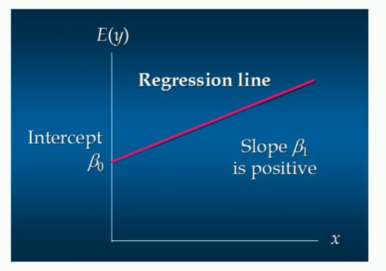
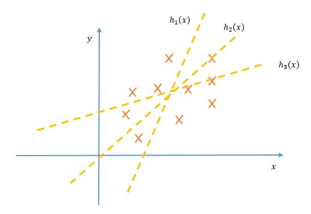
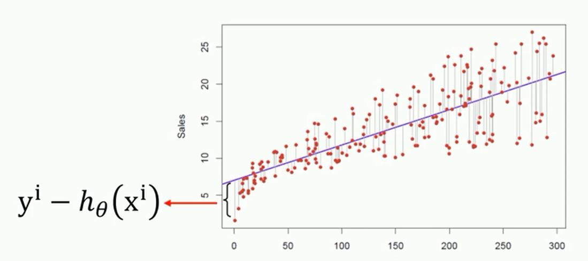
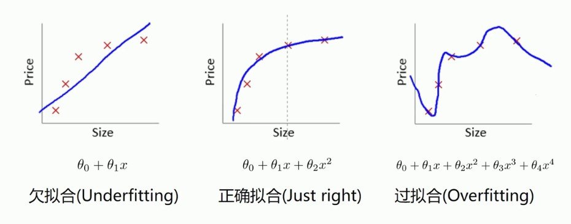

# 回归

## 1 简介

回归分析是一种数学模型。当因变量和自变量具有线性关系时，它们之间便存在这样一种数学模型。

回归这个词最早是被高尔顿提出的，高尔顿受表兄达尔文的影响，非常痴迷于进化论说，因此一直希望把进化论的理论应用到实证中，证明不同人为什么会具有不同的特性。
高尔顿最著名的发现之一是发现了父亲的身高和儿子的身高之间存在着某种特定关系，他通过进一步的研究发现：子辈的平均身高是其父辈平均身高以及他们所处族群平均身高的加权平均和。

总结来说：回归是研究因变量对自变量依赖关系的一种统计分析方法，目的是通过自变量的给定值来估计或预测因变量的均值。它可用于预测、时间序列建模以及发现各种变量之间的因果关系。

回归分析具有以下特点：

1) 能够指示自变量和因变量之间的显著关系；

2) 能够指示多个自变量对一个因变量的影响强度。

回归分析还可以用于比较那些通过不同计量测得的变量之间的相互影响，如价格变动与促销活动数量之间的联系。这些益处有利于市场研究人员，数据分析人员以及数据科学家排除和衡量出一组最佳的变量，用以构建预测模型。

回归主要的种类有：

- 线性回归
- 非线性回归
- 逻辑回归
  - 二元逻辑回归
  - 多元逻辑回归

## 2 回归分析的划分

回归是一个大类，在这个大类之中可以依据自变量个数的多少进行划分。例如有一个自变量的就叫做一元回归。当含有两个自变量的时候，那么就被称作二元回归。当然还可以根据该问题是线性的还是非线性的进行分类。
分类的形式多种多样，可依据具体情况而进行分类。

例如下面的方程：

$$
h(x)=\beta_0 + \beta_1x\tag{1}
$$

假设公式（1）为某个问题的回归线，则其中 $x$ 被称为自变量，$h(x)$ 被称为因变量，$\beta_0$ 是回归线的截距，即在二维坐标上 $y$ 轴的交点，$\beta_1$ 是回归线的斜率，反应了回归线的变化速率以及相关性。

## 3 相关性分析

在回归线当中，一般会进行相关性分析，并且因变量随自变量的相关性对于求解问题来说也是至关重要的。

在当前的划分中，一般有两种相关：

- 正相关
- 负相关

在多元回归中也一样，相关性的主要决定性因素在于自变量前面的系数是正数还是负数。以下面二元回归为例：

$$
h(x)=\beta_0+\beta_1x_1+\beta_2x_2\tag{2}
$$

倘若 $\beta_1$ 是正数，则我们就认为 $h(x)$ 与 $x_1$ 是正相关的，相反如果是负数，则认为 $h(x)$ 与 $x_1$ 是负相关的，同理对于 $x_2$ 来说也一样。

>那么正相关说明什么？负相关又能说明什么呢？

事实上这个问题可以结合实际来回答。假设这是一个学习成绩受娱乐和看书两种因素的一个回归模型。假设 $x_1$ 是指看书，$x_2$ 是指娱乐。同时 $\beta_1$ 是正数，$\beta_2$ 是负数。那么在这个例子中，就说明学习成绩 $h(x)$ 与看书成正相关，与娱乐成负相关，即看书时间越多，你的学习成绩就越好，娱乐时间越多，你的成绩下滑就越大。

## 4 代价函数

上面简单描述了什么是回归，回归的作用以及相关性分析，但是这些的前提都是在有回归线，已经通过相应方法获得回归线的基础上进行分析的。因此我们需要了解，如何去确定一条回归线，怎样去判断什么样的回归线是最好的。

以下图为例：

上图有三条回归线，我们要怎样去判断哪条回归线更符合实际情况，更适合作为该问题的回归模型！

这时候就需要使用代价函数，代价函数定义多种多样，但是一般使用均方差的形式，即如公式（3）所示：

$$
E=\frac{1}{\Delta}\sum_{i=1}^N(y_i-h(x_i))^2\tag{3}
$$

为了求解的便利，其中 $\Delta$ 一般取值为 $2N$。$y_i$ 指 $x_i$ 位置的真实值，$h(x_i)$指回归线上 $x_i$ 预测值，当所有的真实值与预测值的均方差达到最小时，则说明该回归线代价最低，即拟合度最好。如下图所示：

## 5 数据处理

在使用数据进行训练学习时，可能会需要对数据进行处理，比如一组房价数据，价格以分为单位，这个时候就完全没必要，为了计算简单，可以保留到元甚至更大。

一般数据处理有以下两种：

- 归一化
- 均值标准化

### 5.1 归一化

归一化是指将实验数据全部按照公式(4)缩放在[0,1]范围内，然后使用归一化操作后的数据进行训练！

- 举例

假设有数据集 $data={x_0,x_1,x_2,...,x_n}$，归一化操作如下：
$$
x_i=\frac{(x_i-min(data))}{max(data)-min(data)}\tag{4}
$$

### 5.2 均值标准化

均值标准化和归一化类似，只不过操作不一样，还是假设数据集 $data={x_0,x_1,x_2,...,x_n}$，均值标准化如下：

1. 计算数据的平均值：
$$
u=\frac{1}{n+1}\sum_{i=0}^nx_i\tag{5}
$$
2. 计算数据的方差：
$$
s=\frac{1}{n+1}\sum_{i=0}^n(x_i-u)^2\tag{6}
$$
3. 对数据进行标准化操作：
$$
x_i=\frac{x_i-u}{s}\tag{7}
$$

## 6 评估方法

通过训练得到模型之后将需要进行验证，因此评估方法对于模型训练来说是十分重要的。

### 6.1 留出法

留出法通俗来讲是将数据直接划分为训练集和测试集两类，在训练时选择训练集对模型进行训练，训练完成后选择测试集去验证模型训练的效果。

用公式来描述为：假设优数据集 $D$，训练集 $S$，测试集 $T$。则有：

$$
D=S\bigcup T\\
S\bigcap T=\emptyset
$$

>**使用留出法应该注意以下内容：**

- 训练集和测试集的数据分布尽量一致，比如分类任务中保证正负样本比相似
- 由于数据划分有多种方式，可能导致模型评估不稳定可靠，一般可以多次采样，也就是多次使用留出法，采用多次评估指标的均值
- 如果训练集中数据占比较多，此时模型更贴近用全量数据训练的模型，但是测试集较小，评估结果可能不稳定
- 如果训练集中数据较少，和原始数据差异较大。此时降低了评估指标的保真性(fidelity)，一般训练集占比2/3~4/5

### 6.2 交叉验证法

#### 6.2.1 K折交叉验证

将数据集 $D$ 按照一定规则等比例划分为 $k$ 组大小相似的互斥子集数据 $\{D_1,D_2,...,D_k\}$。在训练时每次取其中 $k-1$ 个集合作为训练集，剩下的一个集合作为验证集。此时就有 $C_k^1$ 种方案可供选择。将这一过程对可能的K种选择重复进行最后选出K次评测中平均测试误差最小的模型。

#### 6.2.2 留一交叉验证

K折交叉验证的特殊情形是K＝N， 称为留一交叉验证(leave-one-out cross validation)，往往在数据缺乏的情况下使用。这里，N是给定数据集的容量。

## 7 拟合

在拟合回归线时可能存在以下情况：

- 欠拟合
- 正确拟合
- 过拟合

如下图所示：

欠拟合是指在训练集表现不好，同样在测试集表现也不好！而正确拟合则是训练集和测试集表现都好！过拟合则是在训练集中表现很好，但是在测试集中表现效果较差！

欠拟合发生的原因一般可能是由于训练数据过少造成的，因此适当增加训练数据便可防止欠拟合的发生！

防止过拟合一般有以下三种方法：

- 减少特征
- 增加数据量
- 正则化

正则化有以下两种形式：

- $L_1$ 正则化

$$
J(\theta)=\frac{1}{2m}[\sum_{i=1}^m(h_\theta(x^i)-y^i)^2+\lambda\sum_{j=1}^n|\theta_j|]\tag{8}
$$

- $L_2$ 正则化

$$
J(\theta)=\frac{1}{2m}[\sum_{i=1}^m(h_\theta(x^i)-y^i)^2+\lambda\sum_{j=1}^n\theta_j^2]\tag{9}
$$
