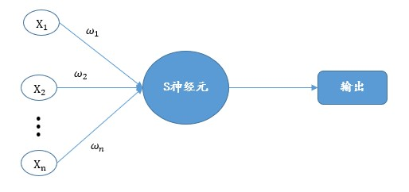

# S 神经元

## 1 介绍

S神经元原理和感知器没有很大差别，可以说很相似，但是与感知器之间的约束不在一样，有更强的约束。



上图就是一个S神经元，它和感知器一样拥有多个输入：$x_1,x_2,...,x_n$。但这些输入的取值被约束在 $[0,1]$ 之间，每个输入对应也拥有权重 $w_1,w_2,...,w_n$，以及最后的偏置,最后的输出变成 $\delta(\sum_{i=1}^nx_iw_i+b)$。

在这里 $\delta$ 被称为 S型函数，定义为：

$$
\delta(z)=\frac{1}{1+e^{-z}}\tag{1}
$$

将 $z$ 使用输入计算规则公式代替，最后的输出公式如（2）式：

$$
\delta(\sum_{i=1}^nx_iw_i+b)=\frac{1}{1+e^{-(\sum_{i=1}^nx_iw_i+b)}}\tag{2}
$$

使用S型函数，当$z = \sum_{i=1}^nx_iw_i+b$ 是一个很大正数，则 $\delta(z)$将近似的等于1，当 $z$ 是一个很大的负数时，$\delta(z)$将近似的等于0，即S型函数将S神经元输出约束在$(0,1)$之间。

S型神经元对分类变化的感知更加强烈，由于不再是二分类，即不是阶跃式输出规则，因此对于细致的变化更加敏感。这样就能对参数进行更加微小的改进。

当然既然S型神经元比感知器更加敏感，那么感知器能做的，S神经元也就能做。

## 2 实践案例

以感知器的那个案例为例：

| $x_1$ | $x_2$ | $y$ |
| ----- | ----- | --- |
| 0     | 0     | 0   |
| 0     | 1     | 0   |
| 1     | 0     | 0   |
| 1     | 1     | 1   |

由于这个案例是一个二分类问题。因此在改变 $output$ 函数之外还需要设置一个分类边界 $border$。根据人为设置边界来进行划分类别，以此达到交运算的效果。

$output$ 函数修改如下：

```py
def output(self, num):
    """
    自定义的规则函数
    :param num: 传入需要计算的值
    :return:
    """
    delta = 1 / (1 + np.exp(-num))
    delta[delta > self.border] = 1
    delta[delta <= self.border] = 0
    return delta
```

初始化函数修改为：

```py
def __init__(self):
    """
    初始化相关参数
    """
    self.w = np.zeros(3)
    self.lr = 0.1
    self.border = 0.5
```

此外，由于 $border$ 值可随时被使用者修改，因此增加一个 $setBorder$ 函数：

```py
def setBorder(self, border):
    """
    分类边界值
    :param border: 传入想要设定的 border
    :return:
    """
    self.border = border
```

当调用S神经元做以下操作时，对应输出如下：

```py
test_num = [[1, 0, 0],
            [1, 1, 0],
            [1, 0, 1],
            [1, 1, 1]]

target_num = [0, 0, 0, 1]

test_num = np.array(test_num)
target_num = np.array(target_num)

Sneuron = S_neuron()

Sneuron.setBorder(0.3)
Sneuron.train(test_num, target_num)
Sneuron.scatter(test_num)
```

>[0. 0. 0. 1.]
w0= -0.8750000000000003 &nbsp;   w1= 0.024999999999999994  &nbsp; w2= 0.024999999999999994

完整代码见 $code$ 文件夹下 S_neuron.py
