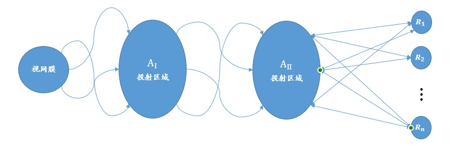
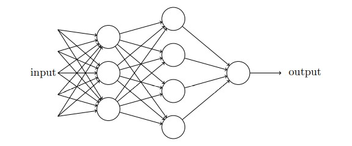
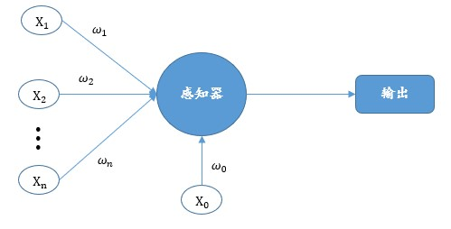

# 感知器

## 1 感知器发源

如果我们最终要了解高等生物的感知识别、概括、回忆和思考的能力，我们必须首先回答三个基本问题：

1. 生物系统如何感知或检测有关物理世界的信息？
2. 信息以什么形式存储或记忆？
3. 存储或记忆中包含的信息如何影响识别和行为？

第一个问题属于感觉生理学领域，并且在上世纪五六十年代已经基本了解，因此，在作者 F. ROSENBLATT 提出感知器时主要关注下面的两个问题。

对于问题二“**信息以什么形式存储或记忆？**”，其中有两种观点，分别为：

1. 以编码表示或图像的形式存储感官信息，在感官刺激和存储的模式之间存在某种一对一的映射。
2. 刺激的图像可能永远不会真正被记录下来，并且中枢神经系统只是充当一个复杂的转换网络，其中保留的形式是活动中心之间的新连接或通路。

按照第一种观点，如果人们理解神经系统的代码或“接线图”，原则上，人们应该能够通过从生物体拥有的“记忆痕迹”中重建原始感觉模式，准确地发现生物体记住了什么。

按照第二种观点，响应代表一个“想法”而不是一个行动。这种方法的重要特征是，根据一些允许稍后重建的代码，从来没有任何简单的将刺激映射到记忆中。无论保留什么信息，都必须以某种方式存储为对特定响应的偏好；即，信息包含在连接或关联中，而不是像地图一样表示。

对于第三个问题，**存储信息对当前活动的影响方式**同样存在两种假设。

1. “编码记忆理论家”给出结论，任何刺激的识别都涉及将存储内容与传入的感官模式进行匹配或系统比较，以确定当前的刺激是否以前见过，并会收到来自生物体的适当反应。
2. 另一方面，经验主义传统中的理论家基本上将第三个问题的答案与他们对第二个问题的答案结合起来：因为存储的信息采用新连接的形式，或神经系统中的传输通道（或创造功能等同于新连接的条件），因此新刺激将利用这些已创建的新途径，自动激活适当的反应，而无需任何单独的过程来识别或识别它们。

此处提出的理论对这些问题采取经验主义或“联结主义”的立场。 该理论是为一种假设的神经系统或机器开发的，称为感知器。 感知器旨在说明一般智能系统的一些基本特性，而不会太深入地陷入特殊的、通常是未知的、适用于特定生物有机体的条件中。

由于符号逻辑和布尔代数的语言不太适合此类研究，此时需要一种合适的语言来对系统中的事件进行数学分析，在这些系统中，只有总的组织可以被表征，而精确的结构是未知的，这导致作者根据概率论而不是符号逻辑来制定当前模型。

### 2 模型假设

感知器理论，可以通过以下假设进行总结：

1. 与学习和识别有关的神经系统的物理连接从一个有机体到另一个有机体是不同的。 在出生时，最重要的网络构建在很大程度上是随机的，受到最少数量的遗传约束。
2. 原始的连接细胞系统具有一定的可塑性； 经过一段时间的神经活动后，由于神经元本身的一些相对持久的变化，施加到一组细胞的刺激会引起另一组细胞反应的概率可能会发生变化。
3. 通过暴露于大量刺激样本，那些最“相似”的（在某种意义上必须根据特定的物理系统进行定义）将倾向于形成通向同一组响应细胞的通路。 那些明显“不同”的将倾向于与不同的响应细胞组建立联系。
4. 正面（和）或负面强化（或提供此功能的刺激）的应用可能会促进或阻碍当前正在进行的任何连接的形成。【即正面强化、负面强化可同时出现，也可只出现其一】
5. 在这样的系统中，相似性在神经系统的某个水平上表现为相似刺激激活相同细胞组的趋势。 相似性不是刺激的特定形式或几何类别的必要属性，而是取决于感知系统的物理组织，该组织通过与给定环境的相互作用而演变。 系统的结构以及刺激环境的生态将影响并在很大程度上决定感知世界被划分成的“事物”的类别。

### 3 感知器的组织结构

以光感知器（以光学模式为刺激作出反应的感知器）为例，该感知器的组织如下图所示，其组织规则如下：



1. 刺激撞击感觉单元（S 点）的视网膜，在某些模型中假设这些单元在全无的基础上做出响应，或者在其他模型中以与刺激强度成正比的脉冲幅度或频率做出响应。 在这里考虑的模型中，将假设一个全有或全无的响应。
2. 脉冲被传输到“投影区域”（$A_Ⅰ$）中的一组关联单元（A-units）。 在某些模型中可能会省略此投影区域，其中视网膜直接连接到关联区域 ($A_Ⅱ$)。投影区域中的每个单元格都从感觉点接收许多连接。将脉冲传输到特定 A 单元的一组点将称为该 A 单元的原点。这些原点对 A 单元的影响可能是兴奋性的，也可能是抑制性的。如果兴奋性和抑制性冲动强度的代数和等于或大于 A 单元的阈值 (6)，则 A 单元再次在全有或全无的基础上触发（或者，在某些模型中，此处不考虑，其频率取决于所接收脉冲的净值）。投影区域中A单元的原点往往聚集或聚焦在某个中心点附近，对应于每个A单元。随着与所讨论的 A 单元中心点的视网膜距离的增加，原点的数量呈指数下降。（这种分布似乎得到了生理学证据的支持，并且在轮廓检测中具有重要的功能目的。）
3. 在投影区域和关联区域 ($A_Ⅱ$) 之间，假设连接是随机的。 也就是说，$A_Ⅱ$ 集中的每个 A 单元从 $A_Ⅰ$ 集中的原点接收一定数量的纤维，但这些原点在整个投影区域中随机散布。 除了它们的连接分布之外，$A_Ⅱ$ 单元与 $A_Ⅰ$ 单元相同，并且在类似的条件下响应。
4. “响应”，$R_1, R_2, . . . , R_n$ 是细胞（或细胞组），其响应方式与 A 单元大致相同。每个响应通常都有大量随机位于 An 集合中的原点。将脉冲传输到特定响应的一组 A 单元将称为该响应的源集。 （响应的源集与其在 A 系统中的源点集相同。）图 1 中的箭头表示通过网络传输的方向。注意直到An所有连接都是前向的，没有反馈。当我们谈到最后一组连接时，在 An 和 R 单元之间，在两个方向上都建立了连接。在大多数感知器模型中，控制反馈连接的规则可以是以下任一种选择：
(a) 每个响应都具有与其源集中的细胞的兴奋性反馈连接
(b) 每个响应都与它自己的源集的补体有抑制性反馈连接（即，它倾向于禁止任何不向它传输的关联细胞中的活动）。

### 4 感知器工作原理

最后将上面的内容抽象理解，每件事物对对都会产生一种感知，而每一种事物给人的感知是不一样的，因此根据不同事物产生的感知最后经过一系列判断得出结果，这就是感知器。

在这里，事物不同造成的感知差异使用权重来分辨，最后通过相应的阈值对本次感知得出结果。

可以这么思考，究其本质，感知器就是根据权重做出决定的一种设备。

以下图单层感知器为例：


上图中的感知器可接受 $n$ 个输⼊，$x_1, x_2,..., x_n$。输入个数通常可以有依据具体情况而定。Rosenblatt 提议使用⼀个简单的规则来计算输出。他引⼊权重，$w_1, w_2, . . .，w_n$表⽰相应输⼊对于输出重要性的实数。神经元输出 0 或者 1，即产生二值输出。并且输出结果由分配权重后计算的总和 $\sum_{i=1}^nw_ix_i$ 决定，当⼩于或者⼤于设定的阈值时做出相应的输出。和权重⼀样，阈值是⼀个实数，⼀个神经元的参数。更具体的情形可如公式（1）所示：
$$
output=\begin{cases}
    0&\sum_{i=1}^nw_ix_i > threshold\\
    1&otherwise
\end{cases}\tag{1}
$$

我们可以举一个便于理解的粒子，假设某天有电影将会上映，而你对这部电影也颇有兴趣，但是还未决定是否去观看，但是目前已知做这个决定会由以下三个因素来作出决定：

1. 天⽓好吗？
2. 电影质量好吗？
3. 今天心情好吗？

同时，对于三个因素在你的心中分别有不同的权重，而这些权重和将会决定你是否去观看这部影片。你可以把这三个因素对应地⽤⼆进制变量 $x_1, x_2 , x_3$ 来表⽰。例如，如果天⽓好，我们把$x_1 = 1$，如果不好，$x_1 = 0$，当然在也可以设置为负，因为天气不好可能会使你不愿意出门。类似地，其他两个因素也这样假设。

随着权重和阈值的变化，你可以得到不同的决策模型。例如，假设我们把$x_1$的权重改为 $w_1 = 3$，其他权重设为 1 ，那么也就说明天气对于你是否去看电影更为重要。最终感知器会按照天⽓好坏，结合其他因素通过权重计算加权和，再与阈值相比较得出最终结果。换句话说，它又可以变成另⼀个不同的决策模型，可以通过阈值控制你去看电影的欲望，降低阈值则表⽰你更愿意去。很明显，感知器不是⼈做出决策使⽤的全部模型。但是这个例⼦说明了⼀个感知器如何能权衡不同的依据来决策。这看上去也可以⼤致解释⼀个感知器⽹络能够做出微妙的决定：


在上面这个⽹络中，第⼀列感知器 —— 我们称其为第⼀层感知器 —— 通过权衡输⼊依据做出三个⾮常简单的决定。那第⼆层的感知器呢？每⼀个都在权衡第⼀层的决策结果并做出决定。以这种⽅式，⼀个第⼆层中的感知器可以⽐第⼀层中的做出更复杂和抽象的决策。在第三层中的感知器甚⾄能进⾏更复杂的决策。以这种⽅式，⼀个多层的感知器⽹络可以从事复杂巧妙的决策。

需要注意的是，上面的每一个感知器都有超过一个输出箭头，但并不意味着感知器有多个输出。多个箭头指向只是说明该感知器处理的结果（输出）被多个其他感知器利用。

### 5 单层感知器

#### 5.1 单层感知器介绍

在上小结已经描述了感知器原理，运行原理公式如（1）所示。为了方便理解，我们可以对公式（1）稍加改进，变成更加易懂常见的形式，即将阈值移到函数计算一边，得到公式（2）：

$$
output=\begin{cases}
    0&\sum_{i=1}^nw_ix_i -threshold\leq0\\
    1&otherwise
\end{cases}\tag{2}
$$

为了方便，后面就直接使用 $b=-threshold$代替阈值，并称 $b$ 为偏置，因此公式（2）就可变成公式（3）：
$$
output=\begin{cases}
    0&\sum_{i=1}^nw_ix_i +b\leq0\\
    1&otherwise
\end{cases}\tag{3}
$$

#### 5.2 计算举例

假如现在有一个单层感知器有两个输入，同时偏置 $b=-0.6,w_1 = 0.5,w_2 = 0.5$。那么按照单层感知器计算公式 $output(\sum_{i=1}^n(w_ix_i)+b)$就可以得到下表的结果：

| $x_1$ | $x_2$ | $y$ |
| ----- | ----- | --- |
| 0     | 0     | 0   |
| 0     | 1     | 0   |
| 1     | 0     | 0   |
| 1     | 1     | 1   |

但是到这里就有一个问题，$w_1,w_2$ 在一开始给出的便符合条件，那有没有一开始就不符合条件的呢？通过学习得来的呢？

#### 5.3 单层感知器学习规则

从上一节我们提出疑问，权重能不能通过学习得来，而非人为的设计指定。这是一个很关键的问题，倘若都是人为指定，那也谈不上智能，也就不是隐式编程，而是显式编程。因此这一小节将讲述单层感知器学习规则。

在上面讲到单层感知器计算表达式如下公式：

$$
y = output(\sum_{i=1}^n(w_ix_i)+b)\tag{4}
$$

单层感知器学习规则如下：

$$
\Delta w_i = \eta(t - y)x_i\tag{5}
$$

其中 $\Delta w_i$ 表示第 $i$ 个权值修正数；$\eta$ 表示**学习率(Learning Rate)**，用来调节权值修正速率；$t$ 表示正确标签。

因此权值调整公式为：

$$
w_i = w_i + \Delta w_i\tag{6}
$$

#### 5.4 代码编写

通过上面的描述，我们就可以据此编写一个简单的单层感知器模型。

首先创建感知器类，并设置初始化对应变量。

```py
def __init__(self):
        self.w1 = 0
        self.w2 = 0
        self.b = -0.6
        self.lr = 0.1
```

在本例中，偏置 $b$ 需要设置为负数，否则根据 $output$ 无法得到正确的分类，你也可以自己思考一下，十分简单，因为在上面表中的数据，即进行交运算时，一定会有不满足的条件。在本例中，设置偏置 $b = -0.6$。

接着定义 $output$ 函数：

```py
def output(self, num):
    if num <= 0:
        return 0
    else:
        return 1
```

在初始化时我们对学习率是进行了初始化的，当然，有可能会需要改变，因此，我们定义一个设置学习率的函数：

```py
def setLearningRate(self, lr):
    self.lr = lr
```

接下来定义训练函数：

```py
def train(self, x, target, train_max=1000):
    """
    训练函数
    :param x: 输入值
    :param target: 目标值
    :param train_max: 最大训练次数
    :return:
    """
    y = target.copy()
    for j in range(train_max):
        for i in range(len(x)):
            y[i] = self.output(self.w1 * x[i][0] + self.w2 * x[i][1] + self.b)
        if y == target:
            break
        else:
            for i in range(len(target)):
                self.w1 = self.w1 + self.lr * (target[i] - y[i]) * x[i][0]
                self.w2 = self.w2 + self.lr * (target[i] - y[i]) * x[i][1]
```

在上面函数中，由于结果需要存储在一个与 $target$ 等长的数组中，因此我们使用 $y = target.copy()$ 操作获得一个等长数组。至于为什么是使用 $copy()$，这就需要了解 $python$ 深浅拷贝的问题。简单说就是直接赋值的话 $y$ 获取到的只是 $target$ 的引用，当对 $y$ 进行操作的时候 $target$ 也会随之改变，因此需要使用 $copy()$ ，这样传递的就是一个内容和 $target$ 的空间。并且两者不再有什么关联。

最后编写预测函数输出预测值：

```py
def scatter(self, x):
    """
    预测函数
    :param x: 需要预测的值
    :return:
    """
    for i in range(len(x)):
        res = self.output(self.w1 * x[i][0] + self.w2 * x[i][1] + self.b)
        print(res)
    print("w1=", self.w1, "   w2=", self.w2, "  b=", self.b)
```

最后进行测试：

```py
test_num = [[0, 0],
            [1, 0],
            [0, 1],
            [1, 1]]
target_num = [0, 0, 0, 1]

perceptron = perceptron()

perceptron.train(test_num, target_num)
perceptron.scatter(test_num)

```

输出结果如下：

>0
0
0
1
w1= 0.30000000000000004  &nbsp;    w2= 0.30000000000000004 &ensp;b= -0.6

上面的代码是没有使用矩阵运算的,全部代码见 example_5_2_1.py，我们也可以使用矩阵进行运算，矩阵运算代码见 $code$ 文件夹  example_5_2_2.py。

#### 5.5 单层感知器的另一种形式

上面是我们单独设置偏置，这只是一个感知器，倘若有很多个呢？亦或者我们也不知道偏置在哪个范围是正确的，因此如果将偏置值一起交给算法自己学习，那不是更方便吗？ 因此感知器就有了一种新的形式，如下图：



此时，我们将偏置 $b = w_0x_0$，同时设置 $x_0 = 0$，倘若使用该形式，那么偏置也不再需要我们进行设置，感知器也可以通过自身进行学习。感知器计算公式也变成下面形式：

$$
y = output(\sum_{i=0}^n(w_ix_i))\tag{7}
$$

根据此形式编写上面的例子，一样可以训练并得到想要的结果。

在之后，一般都将采用这种新的形式，因为这种形式不在需要我们人为的去设置任何值。

看到这里，对感知器应该有了更清晰的了解。之后更加深入的神经网络，就像很多感知器叠加起来，有点类似解方程，当一个方程无限长的时候，我们很难全部解决，那么就可以采取分解成很多小项，然后分别解决，感知器就类似解决问题的最小单元。

### 写在最后

从上面的描述可知，它的参数需要训练，而我们不需要对参数进行设置，只要提供数据便可以得到符合数据的感知器。同时从整体来看，感知器只有两个输出，从这个角度看，感知器的作用也有点像分类器，将数据按照一定规律分成两类。

对于感知器计算公式，在本文中使用的是 $output$ 函数，用该函数训练一个可进行二进制交运算的感知器。

使用不同的激活函数，就可以得到不同的感知器，但是实际采取的激活函数可按实际情况来选取。感知器一般的激活函数为 $sign$ 函数，函数如下所示：

$$
sign(x) = \begin{cases}
    -1&x<0\\
    0&x=0\\
    1&x>0
\end{cases}\tag{8}
$$
