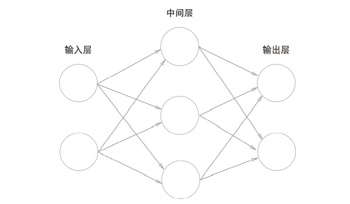
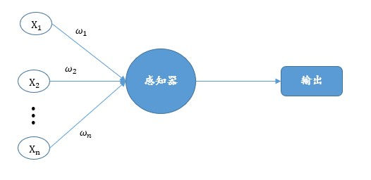
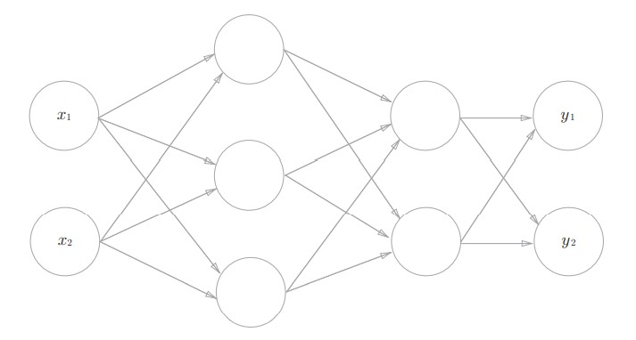
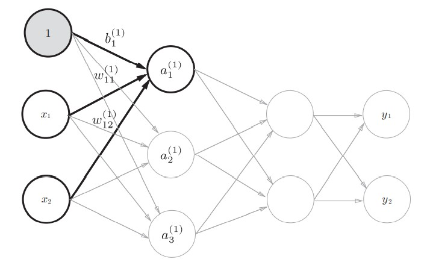

# 神经网络

在前面的学习中，可以发现感知器(也称感知机)可以解决类似简单的问题异或类简单的问题，但是对于复杂的问题，如图像识别等，就有点力不从心了。这一章节，将描述神经网络的运行及构成。

## 1 神经网络构成

> - 问题一：神经网络与感知器有何不同，之间的区别在哪？

### 1.1 神经网络与感知器

为了了解神经网络与感知器之间的区别，可以先看如下两张图片：

上图第一张为神经网络结构图，第二张为感知器的结构图，从两张图片的对比可以发现如下规律：
> 相同点
>
>- 都有输入层和输出层
>
> 不同点
>
> - 神经网络中间层有多个，而感知器只有一个
> - 神经网络输出可有多个，而感知器只有一个
>
> 注意：对于神经网络与感知器来说，输入层的个数都是可以根据具体情况进行调整的

经过上面的分析可以发现，神经网络更像是多个感知器堆叠在一起构成的一个感知器组合，然后使用该结构去处理更加复杂的问题。

> 在这个过程中，我们并没有具体分析每个感知器的内部，比如激活函数形式。在其他视频中，会出现以激活函数对感知器与神经网络来进行分类，每个人的看法不同。当然如果你有自己更好的标准，那更好！

### 1.2 神经网络运算

在前面的感知器中，已经使用了线性代数的相关知识，因此一样的，在神经网络中，运算一样是要使用线性代数的方式，基本的方式是一致的。

下面以下图的3层神经网络为例，实现从输入到输出的（前向）处理。

在上图中，输入层有两个输入，但是经过之前的对于感知器的了解，我们还应该加上偏置以使神经网络更加准确，因此，在实际实现中，也可以将偏置视为一个输入，如下图：

因此对于第一层神经网络中的第一个节点计算公式如下：
$$
a_1^{(1)}=x_1\omega_{11}^{(1)}+x_2\omega_{12}^{(1)}+b_1^{(1)}\tag{1}
$$

同样，对于第一层的其他节点也是通过该方式进行计算，因此可以直接使用线性代数方法。首先对于输入层可以表示成$X=[x_1,x_2,1]$，对应系数可表示为如下模式：
$$
\Omega=\begin{bmatrix}
    \omega_{11}^{(1)}&\omega_{21}^{(1)}&\omega_{31}^{(1)}\\
    \omega_{12}^{(1)}&\omega_{22}^{(1)}&\omega_{32}^{(1)}\\
    b_1^{(1)}&b_2^{(1)}&b_3^{(1)}
\end{bmatrix}
$$

那么
$$
X\Omega=Y^{(1)}
$$

>其中$Y^{(1)}=[a_1^{(1)},a_2^{(1)},a_3^{(1)}]$。
