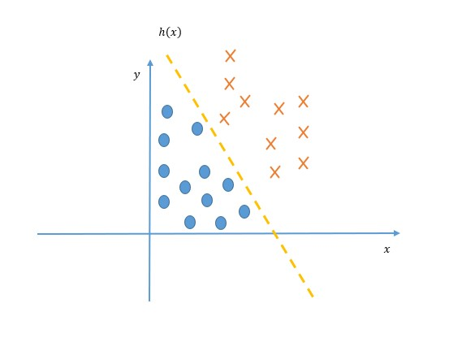
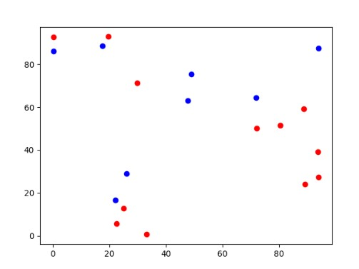

# 逻辑回归

## 1 引言

逻辑回归本质是一种二分类算法，该算法通过使用回归的方法能对样本进行分类。解决连续线性函数不适合进行分类的问题。使用逻辑回归可以做以下行为：

- 垃圾邮件分类
- 预测肿瘤是否良性
- 预测天气

理论上只要是二分类问题，逻辑回归都可以应用到其中！

在逻辑回归中，主要解决两个问题：

1. 回归线的构造
2. 决策边界的查找

如下图所示：


在进行逻辑回归时需要确定回归线 $h(x)$ 的方程，同时应该计算决策边界，通过决策边界对上图的内容进行划分！

## 2 查准率与查全率

## 2.1 概念理解

在逻辑回归中，由于是结果是二值的，因此在评判回归模型好坏的时候，往往使用查准率与查全率来判断。

>查准率又被称为：正确率
查全率也被称为：召回率

- 查准率：指被找到的信息有多少是满足条件的信息

    举例：假设总数据量为 $M$，当前从中查询了 $X$ 条数据，其中满足条件的数据为 $N$ 条，则有：
    $$
        查准率=\frac{N}{X}
    $$

- 查全率：指所有满足条件的信息有多少被找到

    举例：假设总数据量为 $M$，其中满足某条件的数据有 $Y$ 条，从总数据中查询满足条件的数据，共查找到 $E$ 条记录，其中 $E$ 条记录中满足要求的记录有 $T$ 条，则有：
    $$
        查全率=\frac{T}{Y}
    $$

一般我们通过使用查全率和查准率综合评判模型的整体性能，如下计算公式：

$$
F1=2\times \frac{查全率\times 查准率}{查全率+ 查准率}
$$

以上取值范围都在0-1之间，并且越靠近1说明算法效果越好。

## 2.2 矛与盾

上面分析到，两者值越高，越接近1，则说明模型的效果越好，但是，这就像是矛与盾的故事，我们无法同时兼得，只能根据需求来进行平衡。

下面举例说明：

上面说到，查准率就是从数据中查找并得到的值是预想的结果的概率，而查全率则是查询所有该类型的数据能有多少被返回。因此两者有很明显的区分度：

- 对于查准率而言，不在乎查多少，只在乎精确度，即假设有100个训练集，当一个模型训练结束后，肯定是对部分很符合条件的数据能很快查出来，因此当每次只查询1个满足条件的数据时，很有可能查准率是 100%。
- 对于查全率而言，它是在乎数量的，它与实际满足条件的数据量挂钩，因此，只有查找到满足条件的数据越多，查准率越高，然而这与查准率存在一定的冲突，因为当查的数据量越大时，查找到错误数据可能性就越大，从而导致查准率就越低

因此，在评估查准率与查全率时，关键在于查找到两者的平衡点，到达该点，使得 $F1$ 最大。

## 3 激活函数

在逻辑回归中通常使用 $sigmod$ 函数作为激活函数，该函数将线性函数的值域从实数区间压缩到 $(0,1)$ 之间，函数如下所示：

$$
sigmod(x)=\frac{1}{1+e^{-x}}\tag{1}
$$

对数据进行分类，假设数据标签化后有两种分类 $\{0,1\}$ ，同时标签 $y=1$ 的后验概率为：

$$
p(y=1|x)=\frac{1}{1+e^{-w^Tx}}\tag{2}
$$

则标签 $y=0$ 的后验概率为：

$$
p(y=0|x)=1-p(y=1|x)=\frac{e^{-w^Tx}}{1+e^{-w^Tx}}\tag{3}
$$

>在上式中：$x=[x_1,x_2,...,x_d,1],w=[w_1,w_2,...,w_d,b]$，分别是增广特征向量及增广权重向量

## 4 代价函数

由于逻辑回归输出为二值输出 $\{0,1\}$，因此逻辑回归的代价函数形式如下：

$$
cost(\hat{y},y)=\begin{cases}
    -log(\hat{y})&y=1\\
    -log(1-\hat{y})&y=0
\end{cases}\tag{4}
$$

在该代价函数中，当真实值为 $y=1$ 时，有以下情况：

1. 预测值 $\hat{y}=1$，则此时代价为 0
2. 预测值 $\hat{y}=0$，则此时代价为 $\infin$

当真实值为 $y=0$ 时，同样有以下两种情况：

1. 预测值 $\hat{y}=0$，此时代价为 0
2. 预测值 $\hat{y}=1$，此时代价为 $\infin$

因此，上面代价函数公式又可写成如下形式：

$$
cost(\hat{y},y)=(y-1)log(1-\hat{y})-ylog(\hat{y})\tag{5}
$$

## 5 参数学习

逻辑回归采用交叉熵作为损失函数，并使用梯度下降法来对参数进行优化。

假设有给定的训练样本 $\{(x^i,y^i)\}_{i=1}^N$，那么当使用逻辑回归模型进行训练时，便会出现两类样本，即结果为：$\{0,1\}$。假设输出标签为 1 的后验概率为：

$$
\hat{y}^i=\sigma(\omega^Tx^i),1\leq i\leq N\tag{6}
$$

那么各样本的真实条件概率分布可以写成：

$$
P(y^i=1|x^i)={y}^i\tag{7}
$$
$$
P(y^i=0|x^i)=1-{y}^i\tag{8}
$$

使用交叉熵损失函数，其风险函数为：

$$
J(w)=-\frac{1}{N}\sum_{n=1}^N(y^ilog\hat{y}^i+(1-y^i)log(1-\hat{y}^i))\tag{9}
$$

除公式 (9) 的普通代价函数外，还有一个正则化逻辑回归代价函数，公式如下：

$$
J(w)=-\frac{1}{N}\sum_{n=1}^N(y^ilog\hat{y}^i+(1-y^i)log(1-\hat{y}^i))+\frac{1}{2m}\sum_{j=1}^mw_i^2\tag{10}
$$

此时风险函数 $f(w)$ 关于参数 $w$ 的偏导数为：

$$
\frac{\partial J(w)}{\partial w}=-\frac{1}{N}\sum_{n=1}^Nx^i(y^i-\hat{y}^i)\tag{11}
$$

采用梯度下降法，逻辑回归的训练函数为：

$$
w_{t+1}=w_t+\alpha\frac{1}{N}\sum_{n=1}^Nx^i(y^i-\hat{y}^i_t)\tag{12}
$$

其中 $\alpha$ 为学习率，$t$ 代表 $t$ 时刻的模型输出。

## 6 代码编写

接下来按照算法流程对逻辑回归代码进行编写，具体过程如下：

- 第一步：首先生成数据集 data，之后根据对数据集进行随机分类，并将数据集和代码存储至 data3.cvs。具体如下：

```py
import numpy as np

data = np.random.random([20, 2]) * 100
res = np.round(np.random.random(20))
data = np.c_[data, res]
np.savetxt('data3.cvs', data)
```

在我的初始化数据中，各数据点如下所示：



在上图中，数据是无序的，不像在一开始介绍中的那么有序，但是我们是为了理解算法，因此数据对此影响不大，虽然可能会造成拟合效果较差！

接下来开始编写逻辑回归代码。

- 第二步：sigmoid 函数编写：

传入的值中可能有多个特征向量，因此在传入的时候就需要将其计算好，公式为：

$$
x = w_0 + w_1x_1 + w_2x_2 + ... + w_nx_n\tag{13}
$$

最终 sigmoid 会生成一个对其进行评估。

```py
def sigmoid(x):
    res = 1.0 / (1 + np.exp(-x))
    return res
```

- 第三步：损失函数编写：

由于按照公式 (5) 编写代价函数获得的是各特征向量的损失，在这里我们求解平均损失，因此累加求和再除以个数，求其平均数。

```py
def LossFunction(y, res):
    cost = (y-1) * np.log(1 - res) - y * np.log(res)
    return np.sum(cost) / len(y)
```

- 第四步：梯度下降法编写逻辑回归函数：

下面的梯度下降法根据公式 (12) 编写，每隔100次输出损失值。

```py
def LogisticRegression(x, y, iterate_max=1000):
    N = len(y)                  # 获取数据集大小
    x = np.c_[np.ones(N), x]    # 获取增广矩阵
    w = np.zeros(x.shape[1])    # 定义增广权重矩阵
    ita = 0.001                 # 定义学习率
    for i in range(iterate_max):
        res = sigmoid(np.dot(x, w))
        w = w + ita * np.dot((y - res), x) / N
        if i % 100 == 0:
            loss = LossFunction(y, res)
            print(loss)
    return w
```

运行程序损失值输出为：

>0.6931471805599453
0.6247215989285699
0.6246085048585438
0.6244961639095916
0.624384570865639
0.6242737205470146
0.6241636078102152
0.6240542275476736
0.6239455746875252
0.6238376441933783

从输出来看其损失是在不断降低的，最终各权值输出为：

>[-0.033274   -0.01825077  0.01215842]

当然你也可以使用上面的数据集进行查全率和查准率的计算，但是由于一开始实验时数据并不是规则的，因此效果也是极差的。

使用该数据是为了方便，省时省力，因此不必用该数据去评价模型。

全部代码详见 code 文件夹！
